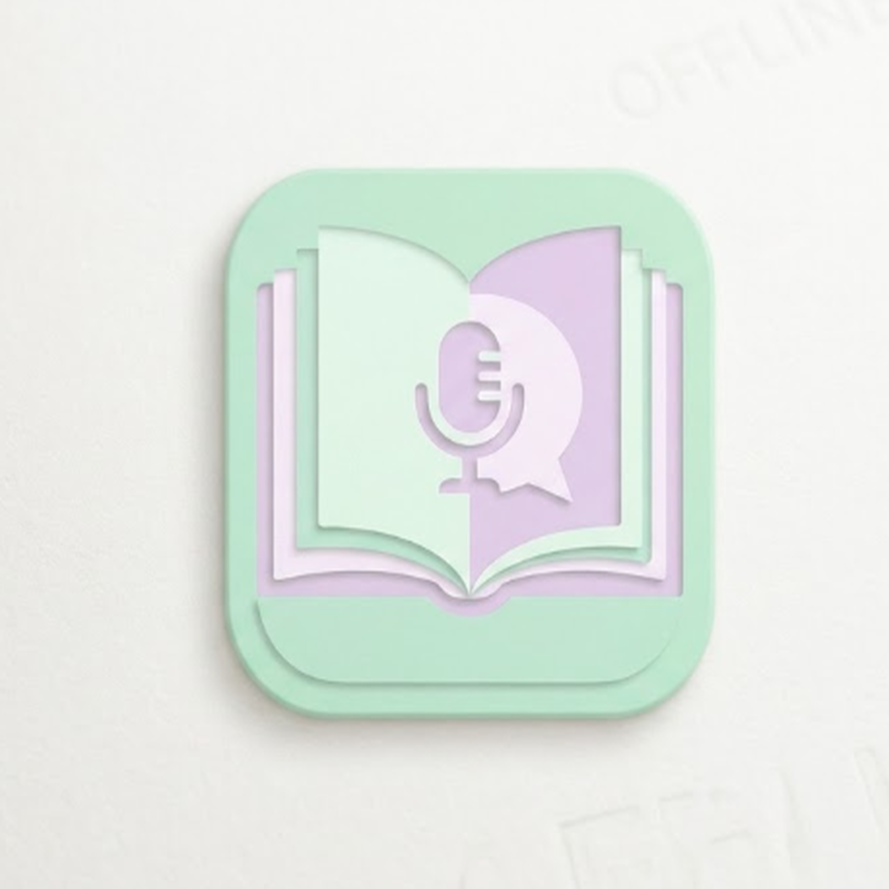

# YourTeacher

An offline English learning desktop application covering levels **A1 to C1**, built with Electron, SQLite, and the Web Speech API. Learn at your own pace — no internet connection required.



## Features

YourTeacher provides a complete structured curriculum with progress tracking, gamification, and practice for all four language skills.

| Feature | Description |
|---|---|
| 📖 Structured lessons | 75 lessons across 25 units and 5 CEFR levels (A1, A2, B1, B2, C1), including reading, vocabulary, and grammar |
| 🧪 Quizzes | 125 quiz questions with instant scoring; units unlock progressively when you score above 70% |
| 🃏 Flip cards | Vocabulary flashcards for every unit |
| 🧩 Sentence builder | Drag-and-drop word games to practice sentence construction |
| 🎧 Listening | Text-to-speech narration with a scrolling dictation game |
| 🎤 Speaking | Pronunciation practice with speech recognition feedback |
| ✍️ Writing lab | Guided writing prompts with self-assessment |
| 📊 Progress tracking | XP points, day streaks, circular progress dashboard, and per-lesson completion |
| 👥 Multiple profiles | Switch between different learner profiles on the same computer |
| 📁 Report export | Export your progress report as a file |
| 🌙 Dark / light theme | Toggle between themes |

## Curriculum

Each of the 5 levels contains 5 themed units, and each unit includes 3 lessons (reading, vocabulary, grammar), a quiz, flip cards, a sentence builder game, and listening/speaking practice.

| Level | Units | Focus |
|---|---|---|
| A1 — Beginner | 5 | Everyday basics: greetings, family, daily routines, food, travel |
| A2 — Elementary | 5 | Shopping, work, health, hobbies, weather |
| B1 — Intermediate | 5 | Relationships, environment, media, careers, culture |
| B2 — Upper-intermediate | 5 | Debate, technology, global issues, literature, economics |
| C1 — Advanced | 5 | Academic writing, nuance, idiomatic fluency |

## How to run from source

You need [Node.js](https://nodejs.org) 18.17 or later installed on your computer.

```bash
# Install dependencies
cd E:\YourTeacher
npm install

# Start the app
npm start
```

## Installers

Pre-built Windows executables are available in the **Releases** section:

- **YourTeacher Setup 1.0.0.exe** — installer (creates Start menu and desktop shortcuts)
- **YourTeacher 1.0.0.exe** — portable version (double-click to run, no installation)

On first run, Windows may show a SmartScreen warning because the app is not code-signed. Click **More info → Run anyway**.

## Project structure

```
YourTeacher/
├── main.js              # Electron main process: window lifecycle, IPC handlers, database
├── preload.js           # Secure context bridge between main and renderer processes
├── package.json         # Project manifest and build configuration
├── icon.ico / icon.png  # Application icon
├── database/
│   └── init.js          # SQLite schema and full A1–C1 curriculum seed data
└── renderer/
    ├── index.html       # Single-page UI (HTML + embedded CSS)
    └── renderer.js      # All app logic: routing, quizzes, games, speech, writing lab
```

## How it works

The app runs entirely offline. All lessons, quizzes, and games are stored in a local SQLite database (created automatically in `%APPDATA%\yourteacher` on first run). Audio for listening and speaking practice uses the built-in Web Speech API of Windows, so no audio files are bundled. Progress (XP, streaks, completed lessons) is saved per profile in the local database.

## Building from source (optional)

```bash
npm install electron-builder --no-optional
npm run build
```

The standalone executables appear in the `dist` folder.

## License

MIT — see [LICENSE](LICENSE) for details.
